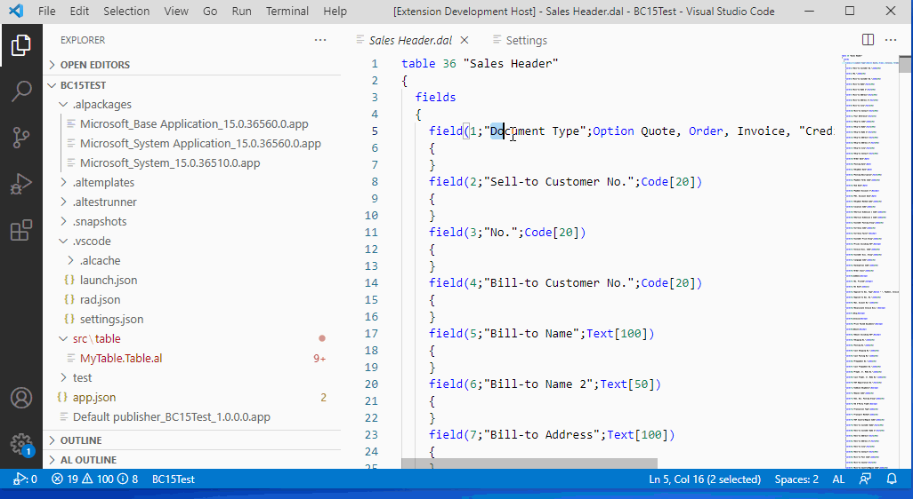
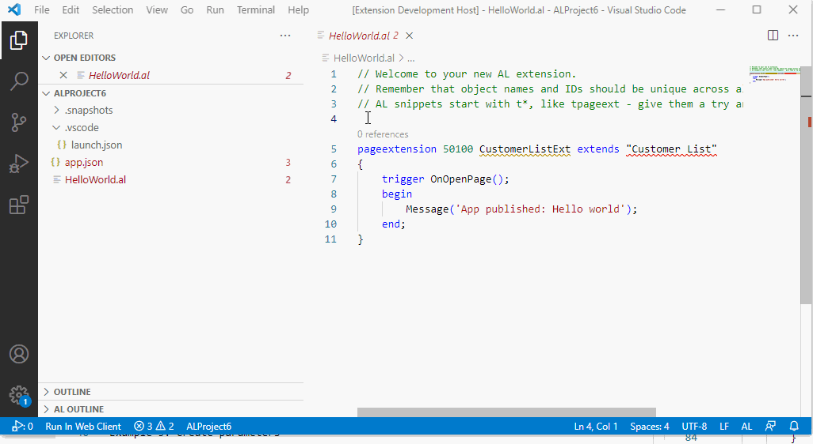
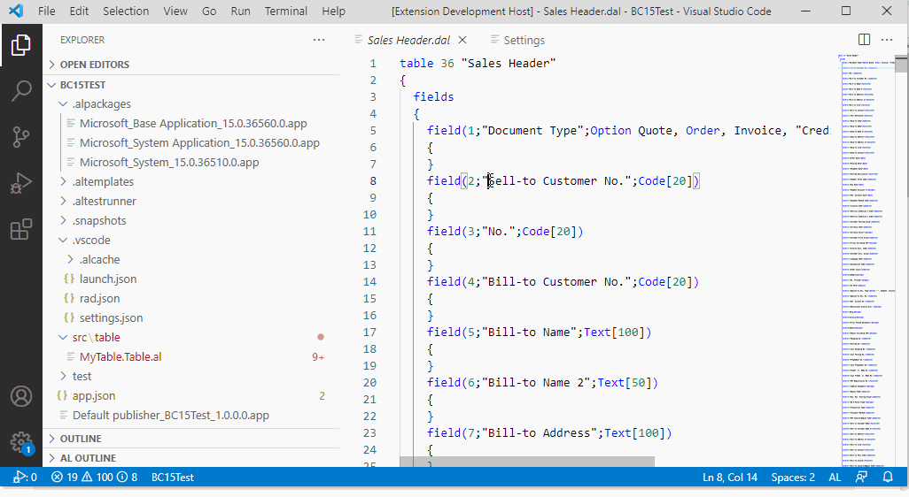
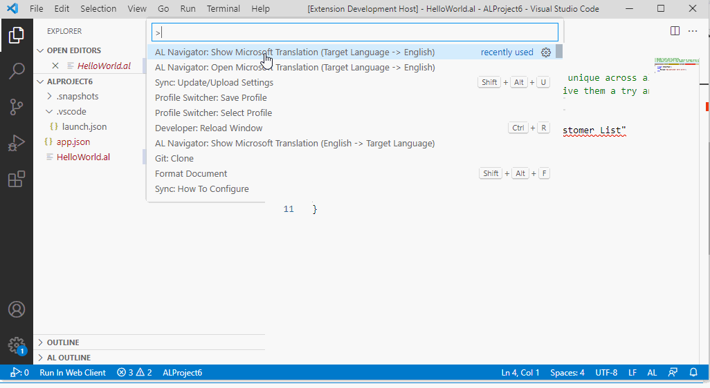
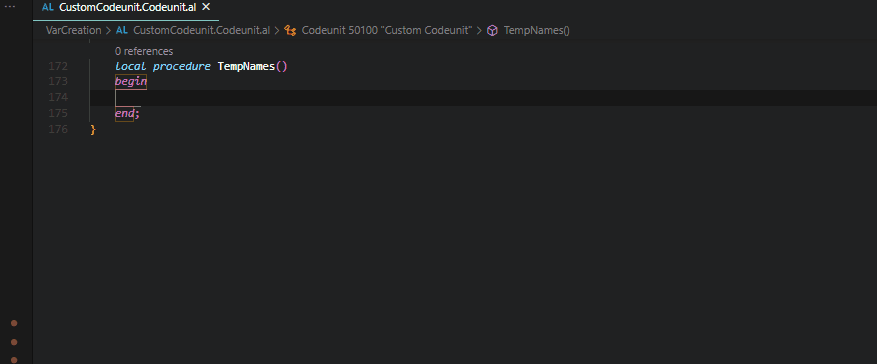
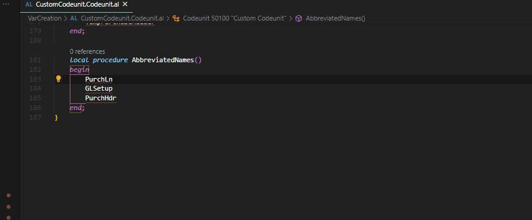
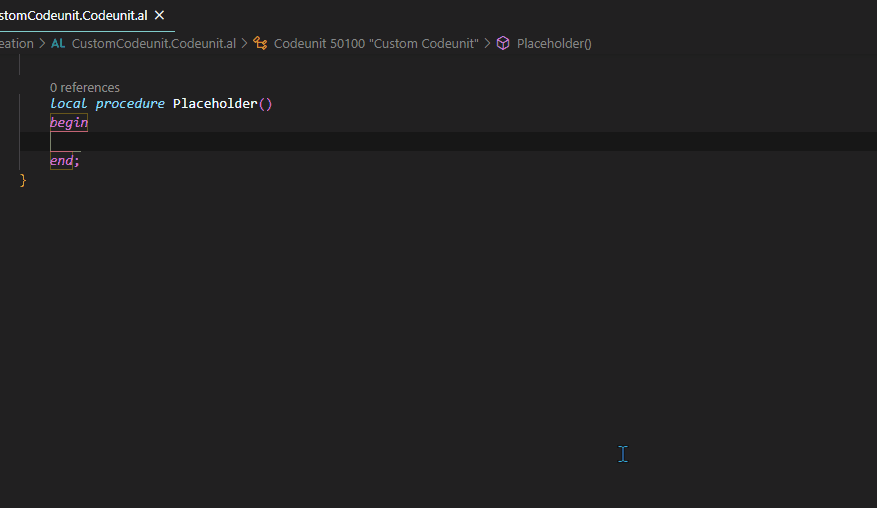

# AL Navigator

Create variables and parameters like a boss. Navigate through al files with awesome shortcuts.

## Features

### Shortcuts

|Shortcut   |Command Name   |Description   |
|---|---|---|
|**Ctrl+Alt+g**   |AL Navigator: End of global variables  |Moves cursor to the end of your global variables.   |
|**Ctrl+Alt+l**   |AL Navigator: End of local variables   |Moves cursor to the end of your local variables.   |
|**Ctrl+Alt+k**   |AL Navigator: Keys  |Moves cursor to the keys in your .al table file.    |
|**Ctrl+Alt+a**   |AL Navigator: Next Action   |Moves cursor to next action in a page .al file.   |
|**Ctrl+Alt+d**   |AL Navigator: Next DataItem (starting from top)  |Moves cursor through data items in your .al report file.    |
|**Shift+Alt+d**   |AL Navigator: Next DataItem (starting from bottom)   |Moves cursor through data items in your .al report file.    |

### Open/Show Translations

AL Navigator: Open Microsoft Translation (English -> Target Language)

AL Navigator: Open Microsoft Translation (Target Language -> English)

AL Navigator: Show Microsoft Translation (English -> Target Language)

AL Navigator: Show Microsoft Translation (Target Language -> English)

### Create Variables and Parameters

CodeAction for AL0118: Create a local/global variable or a parameter by using the quick fix lamp (Ctrl + .).

Example 1: Create local variables

Example 1: Create global variables

Example 3: Create parameters

#### Tips: How To Use the CodeAction
|Tip   |Example   |
|---|---|
|Variable Names for objects like records can automatically be created if they follow the [naming conventions.](https://docs.microsoft.com/en-us/dynamics365/business-central/dev-itpro/compliance/apptest-bestpracticesforalcode#variable-and-field-naming "naming conventions.")   |Vendor can be recognized as Record "Vendor". [Demo](#create-variables-for-objects-like-records)   |
|Use the Prefix "Temp" to create a temporary record variable.   |TempItem can be recognized as temporary Record "Item". [Demo](#prefix-temp)   |
|You can use [Microsoft's suggested abbreviated variable names](https://community.dynamics.com/nav/w/designpatterns/162/suggested-abbreviations "Microsoft's suggested abbreviated variable names") to create variables.   |GLSetup will be recognized as Record "General Ledger Setup". [Demo](#abbreviated-variable-names)   |
|Some frequently used variable names will be automatically created.   |ItemNo can be recognized as Code[20]. [Demo](#frequently-used-variable-names)   |
|Use a placeholder character as variable name and replace it with the suggested variable name.   |variable name "x" can be replaced by "SalesLine" when the record "Sales Line" has been selected. [Demo](#replace-placeholder)   |
|Change the settings "alNavigator.ignoreALPrefix" and "alNavigator.ignoreALSuffix" to ignore these affixes when detecting or creating variables.   |   Set "alNavigator.ignoreALPrefix" to "EX". If you have a table called "EX Test Table" and use the variable name "TestTable", it can be automatically be created. [Demo](#affixes)   |

#### Create Variables for Objects Like Records

#### Prefix Temp

#### Abbreviated Variable Names

#### Frequently Used Variable Names

#### Replace Placeholder

#### Affixes
The prefix "CCO" is removed for the suggested variable name because we set the "alNavigator.ignoreALPrefix": CCO

## Settings
|Setting   |Description|
|---|---|
|alNavigator.ignoreALPrefix   |Removes prefix from suggested variable names.   |
|alNavigator.ignoreALSuffix   |Removes suffix from suggested variable names.   |
|alNavigator.translationTargetLanguage   |Defines the target language for translation functionalities.   |

## Requirements

|              |         |
|--------------|---------|
| AL Language               |  |
| AZ AL Dev Tools/AL Code Outline           |  |

## Thanks to
- David Feldhoff for his contributions and feedback
- Andrzej Zwierzchowski for providing such an awesome API for his AZ AL Dev Tools/AL Code Outline extension

## Additional information
The functionality of this extension is constantly evolving.
To not bloat this readme too much, you can find more detailed documentations and details on my blog (https://navinsights.net/category/al-navigator/).

## Git Repository

https://github.com/wbrakowski/AL-Navigator

## VS Code Marketplace

https://marketplace.visualstudio.com/items?itemName=wbrakowski.al-navigator

## Picture Attribution
<a href="https://vectorified.com/alpaca-icon">Alpaca Icon</a>
