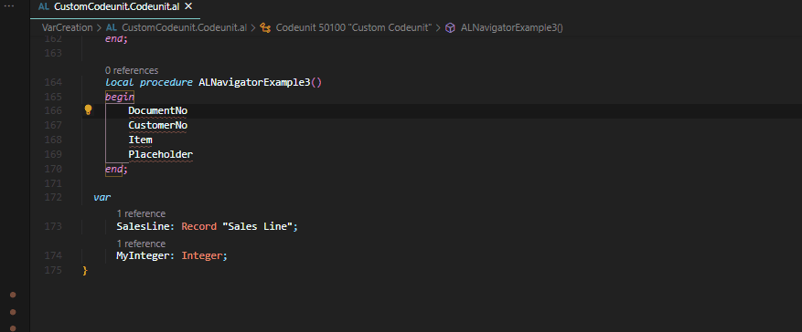

# AL Navigator

Create variables and parameters like a boss. Navigate through al files with awesome shortcuts.

## Features

### Shortcuts

|Shortcut   |Command Name   |Description   |
|---|---|---|
|Ctrl+Alt+g   |AL Navigator: End of global variables  |Move cursor to the end of your global variables (fast way to declare new variables)   |
|Ctrl+Alt+l   |AL Navigator: End of local variables   |Move cursor to the end of your local variables (fast way to declare new variables)   |
|Ctrl+Alt+k   |AL Navigator: Keys  |Move cursor to the keys in your .al file    |
|Ctrl+Alt+a   |AL Navigator: Next Action   |Move cursor to next action in a page .al file   |
|Ctrl+Alt+d   |AL Navigator: Next DataItem (starting from top)  |Move cursor through data items in your .al report file    |
|Shift+Alt+d   |AL Navigator: Next DataItem (starting from bottom)   |Move cursor through data items in your .al report file    |

### Create Variables

CodeAction for AL0118: Create a local/global variable or a parameter by using the quick fix lamp (Ctrl + .=).

Example 1: Create local variables

Example 1: Create global variables

Example 3: Create parameters

#### Tips: How To Use the CodeAction
|Tip   |Example   |
|---|---|
|Variable Names for objects like records can automatically be created if they follow the [naming conventions](https://docs.microsoft.com/en-us/dynamics365/business-central/dev-itpro/compliance/apptest-bestpracticesforalcode#variable-and-field-naming "naming conventions.")   |Vendor can be recognized as Record "Vendor".   |
|Use the Prefix "Temp" to create a temporary record variable.   |TempItem can be recognized as temporary Record "Item".   |
|You can use [Microsoft's suggested abbreviated variable names](https://community.dynamics.com/nav/w/designpatterns/162/suggested-abbreviations "Microsoft's suggested abbreviated variable names") to create variables.   |GLSetup will be recognized as Record "General Ledger Setup"   |
|Some frequently used variable names will be automatically created   |ItemNo can be recognized as Code[20]   |
|Use a placeholder character as variable name and replace it with the suggested variable name   |variable name "x" can be replaced by "SalesLine" when the record "Sales Line" has been selected   |
|Change the settings "alNavigator.ignoreALPrefix" and "alNavigator.ignoreALSuffix" to ignore these affixes when detecting or creating variables   |   |

## Settings
|Setting   |Description|
|---|---|
|alNavigator.ignoreALPrefix   |
|alNavigator.ignoreALSuffix   |

## Requirements

|              |         |
|--------------|---------|
| AL Language               |  |
| AZ AL Dev Tools/AL Code Outline           |  |

## Thanks to
- David Feldhoff for his contributions and feedback
- Andrzej Zwierzchowski for providing such an awesome API for his AZ AL Dev Tools/AL Code Outline extension

## Additional information
The functionality of this extension is constantly evolving.
To not bloat this readme too much, you can find more detailed documentations and details on my blog (https://navinsights.net/category/al-navigator/).

## Git Repository

https://github.com/wbrakowski/AL-Navigator

## Picture Attribution
<a href="https://vectorified.com/alpaca-icon">Alpaca Icon</a>
